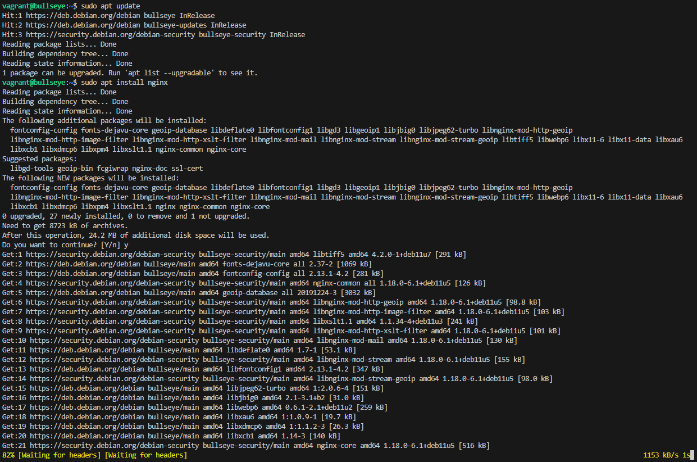
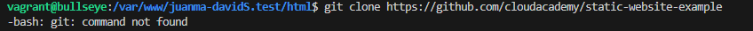
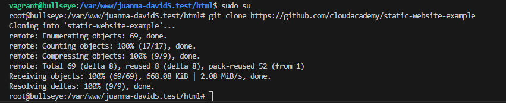
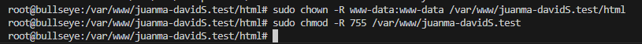
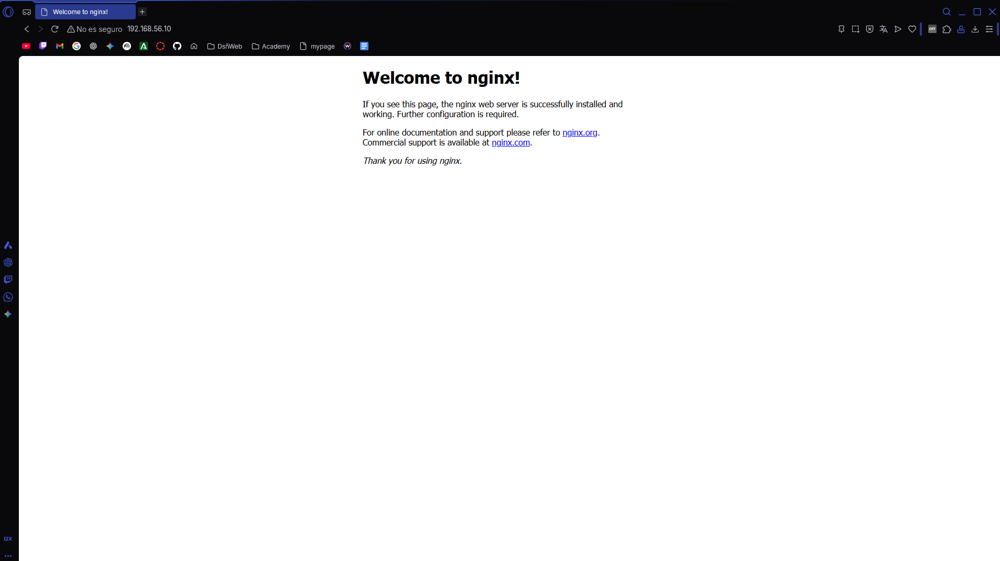

# Instalacion servidor web Nginx    
- Para esto vamos a crear el debian, usaremos el trabajo de dns-paso-paso como base del proyecto.

## Instalacion servidor web Nginx
- Instalamos el servidor en la maquina virtual (con el comando sudo apt update e install).

- Creamos las carpetas donde se localizara el sitio web en nuestro caso pondremos var/www/juanma-davidS.test/html.

- Clonamo desde github una website

  - Nos sale un fallo, cual nos dice que no tenemos instalado git, y luego nos da otro fallo por permisos (se puede arreglar cambiando los permisos o accediendo a root)

- Ahora necesitaremos añadirle permisos a esta carpeta, y abrimos la pagina web desde un navegador poniendo la ip de la maquina.

